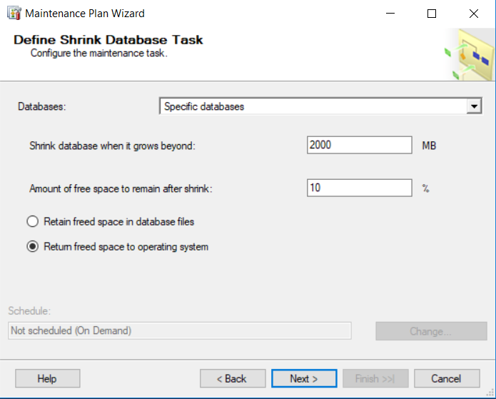
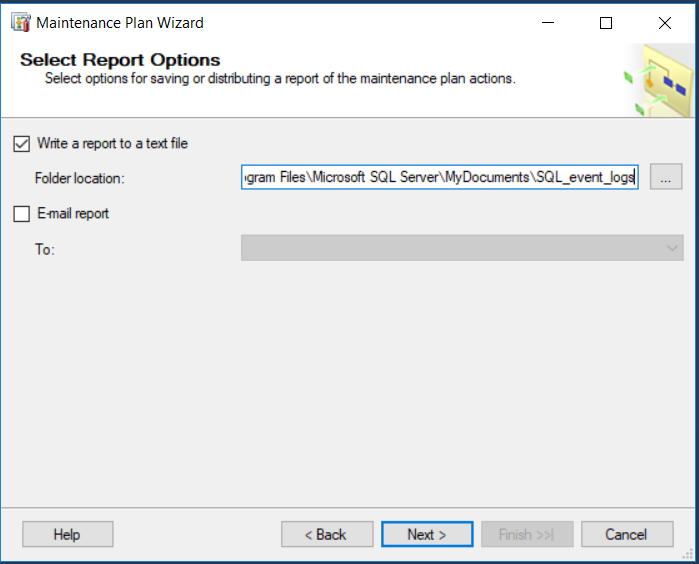
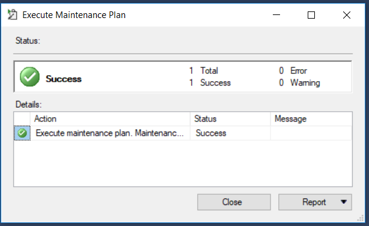

## BD - Laborator Nr. 2
##### Executat de: Țîrdea Nicoleta

### Task 1

> Creați o bază de date plasată fizic în mapa <i><b>MyDocuments\Data</i></b>, fixând o creștere a fișierului primar a bazei de 16 Mb cu limita de creștere de 128 MB și a <i>log</i>-ului de 64 MB cu limita de creștere de 1024 MB. Pentru fișierele secundare să se definească un <i><b>FileGroup</i></b> nou implicit, setând creșterea fișierelor secundare de 64 Mb cu limita de 1024 MB. 

<i>Task 1 - Screenshot</i>

### Task 2

> Creați o bază de date, unde fiesierul <i>log</i> sa fie fizic plasat in mapa <i><b>MyDocuments/Log</i></b>, numele fieserului log in mediului sistemului de operare trebuie sa se deosebeasca de cel logic definit in schema fizica. Este important ca baza de date creata sa fie compatibila cu sistemul <i>MS SQL Server 2017</i> și ea să fie acesibilă unui singur utilizator într-un moment de timp.

<i>Task 2 - Screenshot 1</i>

 

<i>Task 2 - Screenshot 2</i>

### Task 3
> Creați planul de întreținere a bazei de date, construită în sarcina 1. Spațiul neutilizat de fișierele bazei de date trebuie îndepărtat atunci când el atinge mărimea 2000 Mb. Spațiul eliberat trebuie să fie returnat sistemului de operare. Această operațiune trebuie să reluze în fiecare vineri, la ora 00.00. Raportul executării planului de întreținere trebuie salvat în dosarul <i> <b> MyDocuments\SQL_event_logs  </i> </b>. Inițializați executarea planului. După executare, verifacați rezultatele în fișierul <i> log </i>.  

 

<i>Task 3 - Screenshot 1</i>

 
 

<i>Task 3 - Screenshot 2</i>

  

<i>Task 3 - Screenshot 3</i>

### Task 4
Craeți planul de întreținere a bazei de date, construite în exercițiul 2. Numele planului va fi: <i><b>"Recunstruirea Index </b></i>. În cadrul acestui plan, sistemul trebuie să realizeze reconstrucirea indecșilor numai asupra tabelelor dea bază (exclusiv viziunilor) din toate schemele care există în baza de date în cauză. Spațiul liber pe pagină trebuie să fie 10%. Sortarea indecșilor trebuie să se realizeze în <i><b>tempbd </b></i>. După reconstruire, trebuie să uremeze colectarea statisticilor complete despre indecșii reconstruiți. Al treilea pas al planului trebuie să constituie sarcina de ștergere a istoriei despre operațiile de <i>Backup-Restore</i> ce au avut loc pe SQLServer. Trebuie șters istoricul care este mai vechi de 6 săptămâni. Acest plan trebuie să fie executat în fiecare prima duminică a lunii. Creați dosarul <i><b> MyDocuments\SQL_reports</b></i>. Raportul de executare a planului trebuie sa fie adăugat în acest fișier. Procesul de mentenanță- să fie logat în mod <i>extended</i>. Inițializați executarea planului. După executare, verificați rezultatele în fișierul <i>log </i> generat.

