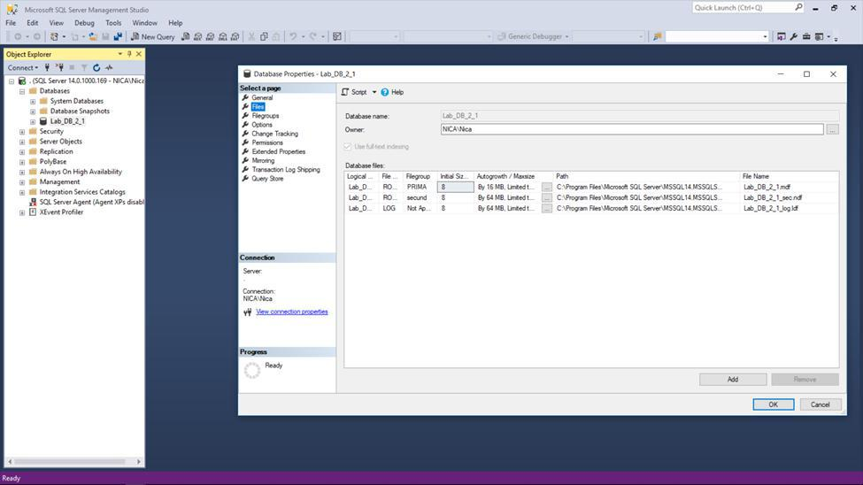
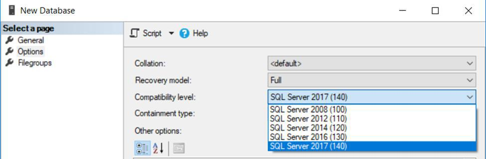
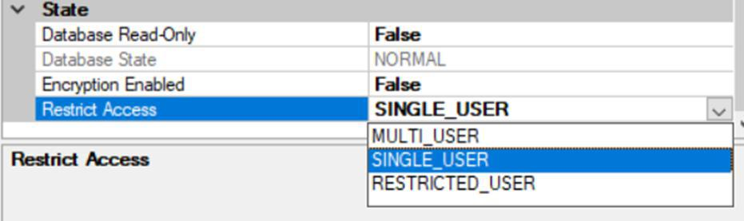

## BD - Laborator Nr. 2
##### Executat de: Țîrdea Nicoleta

### Task 1

> Creați o bază de date plasată fizic în mapa MyDocuments/Data, fixând o creștere a fișierului primar a bazei de 16 Mb cu limita de creștere de 128 MB și a log-ului de 64 MB cu limita de creștere de 1024 MB. Pentru fișierele secundare să se definească un FileGroup nou implicit, setând creșterea fișierelor secundare de 64 Mb cu limita de 1024 MB. 

<i>Task 1 - Screenshot</i>

### Task 2

> Creați o bază de date, unde fiesierul log sa fie fizic plasat in mapa MyDocuments/Log, numele fieserului log in mediului sistemului de operare trebuie sa se deosebeasca de cel logic definit in schema fizica. Este important ca baza de date creata sa fie compatibila cu sistemul MS SQL Server 2017 și ea să fie acesibilă unui singur utilizator într-un moment de timp.

<i>Task 1 - Screenshot</i>

 

<i>Task 1 - Screenshot</i>
